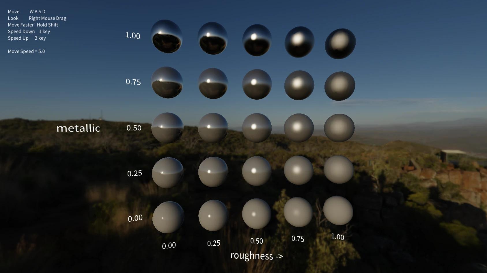

# WonEngine
<p align="center">
  
</p>

WonEngine is a work-in-progress C++ rendering engine for experimenting with modern real-time graphics, editor tooling, and game-engine systems.

> Currently developed on Windows with DirectX 12.  
> The long-term direction is multi-backend (Vulkan) and multi-platform support (Linux and console-oriented platforms).

## Showcase

<table>
  <tr>
    <td width="50%"><br><sub><b>Editor</b> — dockable panels, inspector, and DDGI debug overlay in Sponza</sub></td>
    <td width="50%"><br><sub><b>Environment IBL</b> — metallic × roughness matrix lit by a cubemap sky</sub></td>
  </tr>
  <tr>
    <td width="50%"><video src="https://github.com/user-attachments/assets/204d38e9-62ba-43cb-8d11-6752cc7273bd" width="100%" controls muted>
      Your browser does not support the video tag —
      <a href="https://github.com/user-attachments/assets/204d38e9-62ba-43cb-8d11-6752cc7273bd">watch the showcase clip</a>.
    </video><br><sub><b>Playable sample v0.1.0</b> — third-person physics character in Sponza</sub></td>
    <td width="50%"><video src="https://github.com/user-attachments/assets/2e950cca-4a0c-42ec-ad62-f8321a048352" width="100%" controls muted>
      Your browser does not support the video tag —
      <a href="https://github.com/user-attachments/assets/2e950cca-4a0c-42ec-ad62-f8321a048352">watch the clip</a>.
    </video><br><sub><b>Navmesh pathfinding</b> — Recast/Detour agent navigation and crowd movement</sub></td>
  </tr>
  <tr>
    <td width="50%"><video src="https://github.com/user-attachments/assets/5aff2b73-bf61-4829-8516-a4389217b444" width="100%" controls muted>
      Your browser does not support the video tag —
      <a href="https://github.com/user-attachments/assets/5aff2b73-bf61-4829-8516-a4389217b444">watch the clip</a>.
    </video><br><sub><b>Clustered forward lighting</b> — 2,048 dynamic point lights in a single view</sub></td>
    <td width="50%"></td>
  </tr>
</table>

> More screenshots and videos will be added as the renderer and editor become more stable.

## Getting Started

### Windows

WonEngine is currently developed and tested on Windows.

#### Requirements

- Visual Studio 2022
- CMake 3.20 or later

#### Setup

Build the editor from the WonEngine directory by running the provided batch file:

```bat
Build_Win64.bat Editor
```

The script configures CMake and writes build output to `Binary/Win64/<Config>`. Release is used by default. For a Debug build:

```bat
Build_Win64.bat Editor Debug
```

`Shipping` is the third configuration. It uses the same code generation as Release, and additionally strips debug rendering and developer overlays (debug draw, debug view modes, `r.debug` cvars, the in-game console, and the stat overlay):

```bat
Build_Win64.bat Player Shipping
```

To build every target:

```bat
Build_Win64.bat
```

To run the editor:

```text
Binary\Win64\Release\Editor.exe
```

### Other Platforms

Linux and console-oriented platforms are planned but not currently supported.

## Documentation

- [Documentation](Docs/Documentation.md)
- [Features](Docs/Features.md)
- [Release Notes](Docs/ReleaseNotes.md)
- [Versioning](Docs/Versioning.md)

## Engine Architecture

WonEngine is structured around runtime code, editor code, player and sample applications, shaders, plugins, and offline tools.

```text
Source/
  Runtime/        Core engine runtime source
  Editor/         Editor application source
  Player/         Player application source
  Samples/        Native sample application source
  Shaders/        HLSL shader source and shader interop headers
  Plugins/        Runtime plugin source
  Tools/          Offline tool source, including ShaderOfflineCompiler and PackageTool
  Vendor/         Third-party source

Contents/         Editor and runtime assets
Projects/         Project files
Binary/           Build output, per platform and configuration
Packages/         Packaged builds, per project, platform and configuration
```
