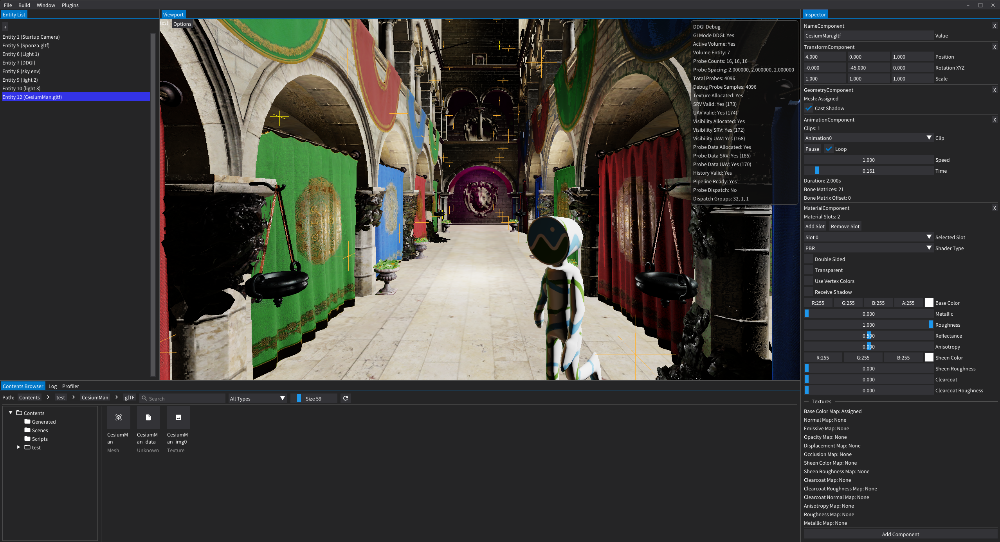

# WonEngine
<p align="center">
  
</p>

WonEngine is a work-in-progress C++ rendering engine for experimenting with modern real-time graphics, editor tooling, and game-engine systems.

> Currently developed on Windows with DirectX 12.  
> The long-term direction is multi-backend (Vulkan) and multi-platform support (Linux and console-oriented platforms).

## Showcase

<p align="center">
  
</p>

### Playable sample — v0.1.0

Third-person physics character in Sponza: input-driven movement, physics interaction (push the crate into the light to ignite the brazier), animation blending, particles, spatial audio, decals, DDGI, and a HUD/sprite clear flow — all driven by sample-local Lua scripts.

<p align="center">
  <video src="https://github.com/user-attachments/assets/204d38e9-62ba-43cb-8d11-6752cc7273bd" width="900" controls muted>
    Your browser does not support the video tag —
    <a href="https://github.com/user-attachments/assets/204d38e9-62ba-43cb-8d11-6752cc7273bd">watch the showcase clip</a>.
  </video>
</p>

> More screenshots and videos will be added as the renderer and editor become more stable.

## Getting Started

### Windows

WonEngine is currently developed and tested on Windows.

#### Requirements

- Visual Studio 2022
- CMake 3.20 or later

#### Setup

Build the editor from the WonEngine directory by running the provided batch file:

```bat
Build_Windows.bat Editor
```

The script configures CMake and writes build output to `Binary/Windows`. Release is used by default. For a Debug build:

```bat
Build_Windows.bat Editor Debug
```

To build every target:

```bat
Build_Windows.bat
```

To run the editor:

```text
Binary\Windows\Editor.exe
```

### Other Platforms

Linux and console-oriented platforms are planned but not currently supported.

## Documentation

- [Documentation](Docs/Documentation.md)
- [Features](Docs/Features.md)

## Engine Architecture

WonEngine is structured around runtime code, editor code, player and sample applications, shaders, plugins, and offline tools.

```text
Source/
  Runtime/        Core engine runtime source
  Editor/         Editor application source
  Player/         Player application source
  Samples/        Native sample application source
  Shaders/        HLSL shader source and shader interop headers
  Plugins/        Runtime plugin source
  Tools/          Offline tool source, including ShaderOfflineCompiler and PackageTool
  Vendor/         Third-party source

Contents/         Editor and runtime assets
Projects/         Project files
Binary/           Build output
```
